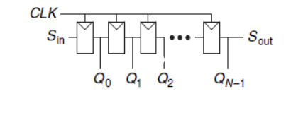

# Digital Building Blocks

* [Arithmetic Circuits](digital-building-blocks.md#ac)
  * [Adders and Subtractions](digital-building-blocks.md#as)
  * [Comparator](digital-building-blocks.md#com)
  * [Shifter and Rotators](digital-building-blocks.md#shre)
  * [Multiplicator](digital-building-blocks.md#mul)
  * [Divider](digital-building-blocks.md#di)
* [Counters](digital-building-blocks.md#co)
* [Shift Registers](digital-building-blocks.md#sr)
* [Memory Arrays and Logic Arrays](digital-building-blocks.md#mala)
* [Number System](digital-building-blocks.md#ns)

This part reviews some elaborate combinational and sequential building blocks used in digital systems such as arithmetic circuits, counters, shift registers, memory arrays and logic arrays.

## Arithmetic Circuits

### Adders and Subtractions

#### Adders: Carry Propagate Adder \(CPA\)

The basics element for the adder is called full adder, where $$A + B + C_{in} = C_{out}S$$:

 $$S = A \oplus B \oplus C_{in}$$ and $$C_{out} = AB + AC_{in}+BC_{in}$$\*\*\*\*

**Ripple Carry Adder**

The addition is executed sequentially from input side to the output side and all the adders wait for the $$C_{out}$$ from their precedent as the $$C_{in}$$ of its input.

* Delay time: $$t_{tripple} = Nt_{FA}$$, where $$t_{FA}$$ is the delay of a full adder.
* Advantage: Simple and cheap.
* Disadvantage: Too slow especially when the size is large.

**Carry Look-Ahead Adder**

Carry look-ahead adder tries to reduce the propagation time by dividing into blocks which can quickly determine the carry out of a block as soon as the carry in is known. For each block, it uses **generator** which means whether the column generates the bit 1 without the carry in and **propagator** means whether it propagates the carry in bit.

$$G_i$$: generated signal from column i. $$G_i = A_iB_i$$. $$P_i$$: if column i propagates the signal. $$P_i = A_i + B_i$$.

$$C_i = A_iB_i + (A_i + B_i)C_{i-1} = G_i + P_iC_{i-1}\\G_{3:0} = G_3 + P_3(G_2 + P_2 (G_1 + P_1G_0))\\P_{3:0} = P_3P_2P_1P_0\\C_i=G_{i:j} + P_{i:j}C_j$$

Here is an example of 32-bit carry look ahead adder, in \(a\) the adder is divided into 8 4-bit CLA block, in \(b\) is the diagram of each block: 

* Delay time:$$t_{CLA} = t_{pg} + t_{pg\_block} + (\frac{N}{k}-1)t_{AND\_OR} + kt_{FA}$$. Where $$t_{pg}$$ is the delay of the individual gates to generate $$G_i$$ and $$P_i$$, $$t_{pg\_block}$$ is the delay to find the $$P_{i:j}$$ and $$G_{i:j}$$ for a k-bit block, and $$t_{AND\_OR}$$ is the delay from $$C_{in}$$ to $$C_{out}$$ through the final AND/OR logic of the k-bit CLA block. Finally, the critical path through the last block contains a short ripple-carry adder $$t_{FA}$$. The computation of $$G_i$$ and $$P_i$$ is to propagate the $$C_{out}$$ quickly to the next block, we still need the ripple-carry adder to calculate the output $$S$$.  
* Advantage: For N &gt; 16 it is much faster.
* Disadvantage: Still increases linearly but more expensive.

**Prefix Adder**

Prefix adders extend the generate and propagate logic of the carry look ahead adder to perform addition \($$C_i$$ for each column\) even faster. They first compute G and P for pairs of columns, then for blocks of 4, then for blocks of 8, then 16, and so forth until the generate signal for every column is known.

$$S_i = (A_i \oplus B_i) \oplus C_{i-1}$$ and $$C_{i-1} = G_{i-1:-1}$$, so we can rewrite it as $$S_i = (A_i \oplus B_i) \oplus G_{i-1:-1}$$.

The update equation: $$G_{i:j} = G_{i:k} + P_{i:k}G_{k-1:j}\\P_{i:j} = P_{i:k}P_{k-1:j}$$

Here is the schematic of the prefix adder:

* Delay time: $$t_{PA} = t_{pg} + log_2N(t_{pg\_prefix}) + t_{XOR}$$, where $$t_{pg\_prefix}$$ is the delay of a black prefix cell.
* Advantage: very fast.
* Disadvantage: expensive.

#### Subtraction

The subtraction module is designed based on the addition module: $$Y = A-B$$  and $$-B = \bar B + 1$$ , $$Y = A + \bar B + 1$$ .  So, we can perform it with a single CPA by adding $$A + \bar B$$ , with $$C_{in} = 1$$ .

### Comparator

* Equality Comparator:

* Magnitude Comparator: calculate A-B and check the sign bit, if the result is negative the sign bit is 1.

### Shifter and Rotators

#### Shifter

Shifter shifts a binary number left or right by a specified number of position, which can also be taken as multiply or divide by power of 2. An N-bit shifter can be built from N:1 multiplexers.

#### Rotators

Replaces the ground or high voltage by $$A_i$$ in the shifter, then we can get a rotator.

### Multiplicator

The progress of the N-bit binary multiplication module: $$A \times B$$  can be taken as multiplying a N-bit number A with each bit in B: $$R_i = A \times B_i$$ and add them with a left shift value $$i$$ : $$\sum {(R_i *2)}$$ .

### Divider

The divider sets the remaining most significant bit $$A_i$$ as the least significant bit and shift R left 1 bit. 

$$R' = 0; \\ for \  i \in [N-1:1]\\ \quad R = {R'<<1,A_i} \\ \quad D = R - B;\\ \quad if \ D>=0:\\Q_i = 1; \ R' = D\\  \quad else: \, Q_i = 0;\ R' = R$$ 

## Counters

An N-bit counter composed of an adder and a resettable register. On each cycle, the counter adds 1 to the value stored in the register. And assign it as the next stored value of the register.   

## Shift Registers

A shift register has a clock, a serial input $$S_{in}$$ , a serial output $$S_{out}$$ , and N parallel outputs $$Q_{N-1:0} $$ . The serially provided input is shifted in on each clock rising edge and the others are shifted forward. After N cycles, the past N inputs are available in parallel at Q. It can be taken as **serial to parallel**.

A shift register can be modified to perform both  **serial-to-parallel** and **parallel-to-serial** operations by adding a parallel input $$D_{N-1:0}$$, and a control signal Load:

## Scan Chains

Scan Chain is a variant of shift register, which can be used to test sequential circuits. A test mode is added to read out or load the contents of all flip-flops with desirable values. In **normal** operation, the flip-flops load data from their D input and ignore the scan chain. In **test** mode, the flip-flops serially shift their contents out and shift in new contents using $$S_{in}$$ and $$S_{out}$$ .

## Memory Arrays and Logic Arrays

The memory is organized as a two-dimensional array of memory cells. An 2N array with N-bit addresses and M-bit data has rows and M columns. Each row of data is called a word. Thus, the array contains 2N M-bit words. The depth of an array is the number of rows, and the width is the number of columns, also called the word size.

Memory arrays are built as an array of bit cells, each of which stores 1 bit of data:  

During a memory read, a wordline is asserted, and the corresponding row of bit cells drives the bitlines HIGH or LOW.

|  | DRAM | SRAM | ROM | Flip-Flops |
| :--- | :--- | :--- | :--- | :--- |
| Volatile | yes | yes | no | yes |
| Store Method | charge on a capacitor, | a pair of cross-coupled inverters | the presence or absence of a transistor | ------ |
| Need Refresh | yes | yes | no | yes |
| Transistors Per Cell | 1 | 6 | ------ | 20 |
| Latency  | Slow | Medium | ------ | fast |

## 

## Number System

#### Int

#### Double

References:

1. &lt;&lt;Digital Design & Computer Architecture&gt;&gt;
2. 

